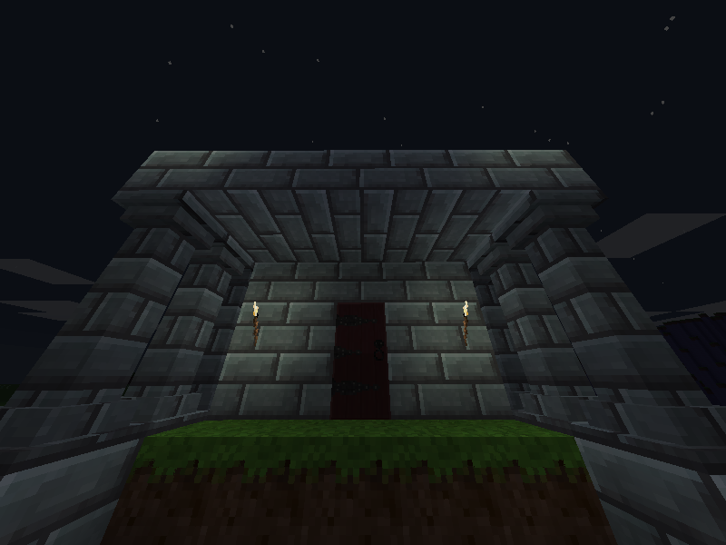

Dungeontest
===========

This is a game built using the [Minetest engine](https://github.com/minetest/minetest/).

This game will generate an infinite underground dungeon maze based on a simple binary tree algorithm.

This means the whole underground is a dungeon, and exploring it is the only way to gather resources. Even though you will start up in the surface of the world (along the vegetation and stuff) You do not start up with any tools that would allow you to obtain a renewable source of food (other than what you find scattered in the wilderness), so you may have to enter the dungeon from the start.

Guidelines
----------

* What this game is not:

  * __It's not about mining__. Rarely will a block be "oddly breakable by hand" (only if it actually makes sense for a player to pick it up and use it). The main dungeon structure is compossed by reinforced blocks that no tool will break. Only when being under creative mode will this guideline be void.
  * __It's not about crafting__. The players only have a 2x2 grid for very basic crafting (repairs, combining items and so) and it's intended to stay like this (no workbenches). The idea is that exploration of the dungeon should be rewarded more. If there's an item you want, instead of crafting you would have to get it as loot from some enemy, find it randomly in chests on certain levels or discover the particular room that offers a way to obtain it. This means you won't be able to craft a pickaxe in the first place, so in a way this also reinforces the previous statement.

* What this game is:

  * __It's a Work-In-Progress__. And it might be for a long time. At this point I'm not very afraid of breaking stuff if it helps the game development in some way. Expect things working in unexpected ways at times. You can always give me suggestions in the forum thread.
  * __It's meant to be extensible__. The idea is that it should be easy to add stuff for dungeon rooms: traps, chests, scrolls, mobs and decorations. Also anything that can have variations of it should be allowed to.
  * __It's meant to give freedom to Dungeon Makers__. Entering in creative mode should give you access to more stuff than what normal creative mode allows you to. And some nodes should bahave different when interacted with to offer better editing possibilities (for example: the spawners don't change state, the "bones" mod was extended so that a creative player can add their custom corpse with whatever stuff he wants inside of it, whereas a normal player can only take stuff out).
  * __It's based on Roguelike elements__. I will always try to draw elements from modern roguelike games like [Stone Soup Dungeon Crawl](https://crawl.develz.org/) and so.

Being a Dungeon Maker
=====================

Currently, to start Dungeon Making you need to run the game in creative mode.

Just get into a dungeon room and start changing stuff. Everything that is in-between the dungeon walls of a room will be saved, but not the dungeon walls themselves.

This currently gives you a 15x10x15 space. This should be enough for most purposes. There's no support for bigger rooms at the moment, unless you change the hardcoded default, but this will break previously saved rooms.

You can however make the rooms smaller simply by added additional layers of wall, which will get saved along the room schematic.

To save and load the current room (the one your player is currently standing on) you can respectively enter the following commands in the Minetest console (F10):

    /rsave <NAME_OF_THE_ROOM_FILE>

    /rload <NAME_OF_THE_ROOM_FILE>

This will save/load the whole room to/from a  file that will sit in  "worlds/<WORLDNAME>/rooms/<NAME_OF_THE_ROOM_FILE>.mts" directory.

The room will also be added to the pool of rooms that will be randomly selected during dungeon generation.

I'm looking forward to you guys making cool rooms that you can share so that they can be included in the game by default! Just let me know.

Future Plans
============

At the moment this game is mostly an experiment. I want to see in which ways I can improve the gameplay and towards which directions it could head to.

Possible ideas:

* Instead of having an infinite dungeon with interconnected up and down stairs, divide the dungeons in areas and use a more interesting maze algorithm (like a backtracker). This would allow for perhaps more interesting dungeons and a few more possibilities (keep reading).
* Make "creative mode" a per-player and per-dungeon-area status. This way we could have an item ("Dungeon Master rulebook"?) at a really deep level of the dungeon that gives the player that picks it "ownership" of the particular dungeon area, allowing him to set up his own traps and rooms (requires a system in place to make sure they are solvable). If another player manages to go through the rooms too he could take ownership of the dungeon instead.
* Display some sort of "hall of fame" for each dungeon area indicating which players have reached the highest level in each dungeon.
* ... please suggest your own ideas in the forum thread :)

Compatibility
--------------

In theory this game would be compatible with most mods based on minetest_game,
however due to its particular nature many of them might be unsuitable for it
or, if they add features to the underground, they may bring havoc to the dungeon.

In general, all mods that add monsters and other creatures from the "mobs_redo"
mod should be compatible with Dungeontest, though you might have to adapt them to
register

License of source code
----------------------
Copyright (C) 2015 Fernando Carmona Varo <ferkiwi@gmail.com>
See README file in each mod directory for information about other authors.

This program is free software; you can redistribute it and/or modify
it under the terms of the GNU Lesser General Public License as published by
the Free Software Foundation; either version 2.1 of the License, or
(at your option) any later version.

This program is distributed in the hope that it will be useful,
but WITHOUT ANY WARRANTY; without even the implied warranty of
MERCHANTABILITY or FITNESS FOR A PARTICULAR PURPOSE.  See the
GNU Lesser General Public License for more details.

You should have received a copy of the GNU Lesser General Public License along
with this program; if not, write to the Free Software Foundation, Inc.,
51 Franklin Street, Fifth Floor, Boston, MA 02110-1301 USA.

License of media (textures and sounds)
--------------------------------------
Copyright (C) 2010-2015 Fernando Carmona Varo <ferkiwi@gmail.com>, celeron55, Perttu Ahola <celeron55@gmail.com>
See README.txt in each mod directory for information about other authors.

Attribution-ShareAlike 3.0 Unported (CC BY-SA 3.0)
http://creativecommons.org/licenses/by-sa/3.0/

License of menu/header.png
Copyright (C) 2013 BlockMen CC BY-3.0
